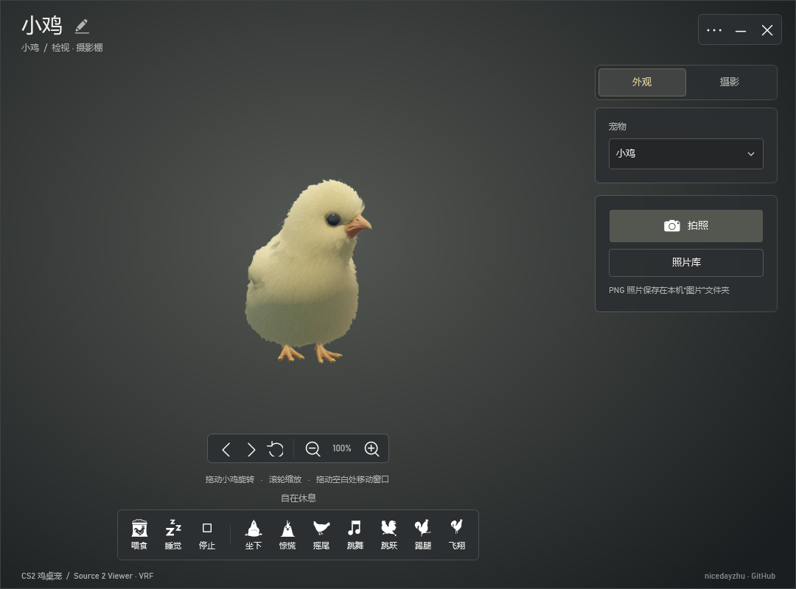

# CS2 Chicken Desktop Pet

English | [简体中文](README.zh-CN.md)

Bring the CS2 chick to your Windows desktop. This 3D pet renders bundled models, materials, and animations in real time using [ValveResourceFormat](https://github.com/ValveResourceFormat/ValveResourceFormat). No CS2 or Steam installation is required.

## Features

- The chick is the default pet. Choose regular, Polish, or Silkie chickens and their available appearances, or try a hatching egg. The pristine egg is a static appearance.
- Feed, perform, sleep, or wake your pet. Supported actions include sitting, acting startled, tail wagging, dancing, jumping, kicking, and flying.
- Hover to reveal an interaction bar that closes when you move away. Unsupported actions are disabled.
- Use the inspection and photo studio to rotate, zoom, rename your pet, switch appearances, and take photos.
- Configure desktop roaming, staying on top, power saving, size, and rotation through a compact context menu.
- Available pets and compatible animations are discovered from the bundled resources at startup. If a saved appearance becomes unavailable, the app falls back to the default chick.

## Getting Started

| Requirement | Details |
| --- | --- |
| System | Windows 10 or 11, x64 |
| Runtime | [.NET 10 Desktop Runtime for Windows x64](https://dotnet.microsoft.com/download/dotnet/10.0) |

1. Download the Windows x64 archive from [GitHub Releases](https://github.com/nicedayzhu/ChickenDesktopPet/releases/latest).
2. Extract the entire archive and run `ChickenDesktopPet3D.exe`. Keep the `Resources/` folder next to the EXE.
3. Allow a few seconds for the initial load.

To upgrade, exit the previous version and replace both the EXE and `Resources/`. The resource snapshot is about 69 MiB and can be updated independently; the app does not search for an installed game. Version details and release notes are available on the [GitHub Release page](https://github.com/nicedayzhu/ChickenDesktopPet/releases).

## Desktop Controls

| Input | Action |
| --- | --- |
| Single-click | React |
| Double-click | Perform |
| Middle-click | Feed |
| Drag | Move the pet |
| Scroll | Rotate the view |
| Hover for about half a second | Open the interaction bar |
| Right-click the pet or tray icon | Open the context menu |

The context menu groups pet selection, interactions, photos, desktop settings, and project information. Sleep/wake controls reflect the current state; settings use checkmarks. The hover bar can be disabled in desktop settings.

## Inspection and Photo Studio

Open the studio from the hover bar or context menu, or launch `ChickenDesktopPet3D.exe --inspect`.

- Drag the pet to rotate; scroll or use the magnifier buttons to zoom. Drag the title or an empty preview area to move the window. Shift+dragging the pet also moves the window, and its edges can be resized.
- Select a pet and appearance in the side panel. Click the pencil beside its name to edit it; Enter saves and Esc cancels editing. Appearance changes preserve the pet's name.
- Use the bottom action bar for interactions. Space stops the current action; Esc returns to the desktop.
- Choose a studio, light, dark, or transparent background. Click the photo button or press Ctrl+P to save a 512×512 PNG. The photo library opens images or their containing folder.

Settings are stored in `%APPDATA%\ChickenDesktopPet\settings3d.json`. Photos are stored in the `CS2 鸡桌宠/` subfolder of your Windows Pictures folder.

## Compatibility and Current Scope

The application interface is currently in Chinese. Available interactions depend on the selected model's animations. Pet names and photos are local; the app does not connect to Steam inventory progression or photo services. Gaze tracking, map effects, and headwear are not currently implemented.

## Documentation

- [Development guide](docs/DEVELOPMENT.md): build, configuration, rendering, and the earlier 2D implementation.
- [Asset bundle maintenance](docs/ASSETS.md) (Chinese): extraction, updates, manifest verification, and packaging.
- [Renderer regression checks](tests/RendererRegression/README.md) (Chinese).
- [CS2 Panorama pet UI research](docs/official-pet-ui-research.md) (Chinese).

## Credits and License

Created by [niceday_zhu](https://github.com/nicedayzhu), with rendering powered by [Source 2 Viewer / ValveResourceFormat](https://github.com/ValveResourceFormat/ValveResourceFormat).

Project source is licensed under [MIT](LICENSE). Third-party components and game content have their own terms; see [Third-Party Notices](THIRD_PARTY_NOTICES.md). Bundled CS2 models, materials, animations, and icons belong to Valve and are not licensed under this project's MIT license.
